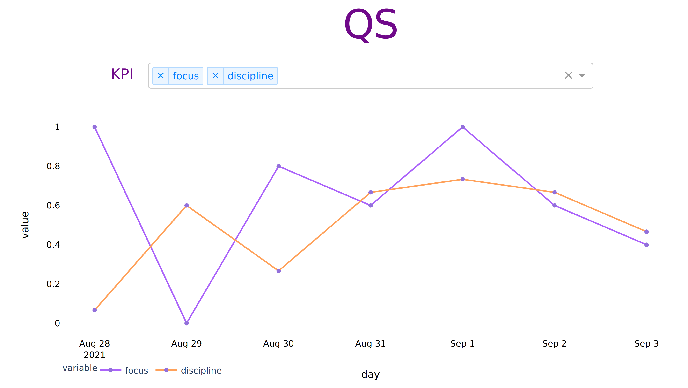
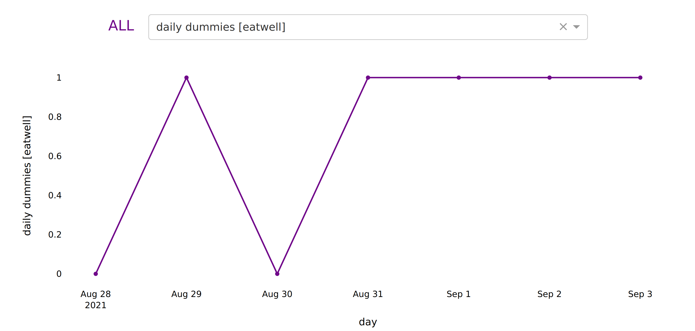

Daily quantified self webapp
================
Alessandro Festi
August 30, 2021

Human beings can improve their flaws as well as they can make them worse.
We tend to suffer from short term vision: remember better what's closer in time. But that doesn't mean that more recent events are more important than past ones.
The daily quantified self webapp come in handy to monitor day by day personal KPIs like happiness, healthy routine and adherence to our personal objectives in order to make the historical data of our personal changes visible and straightforwared

The webapp:
- automatically download data from google drive (we must fill daily our custom form with the metrics of interest)
- transforms and creates the necessary KPIs
- builds a local docker container to host the DASH webapp
- updates and runs the image every day through a cronjob

Below a couple of screens from the app

 

 